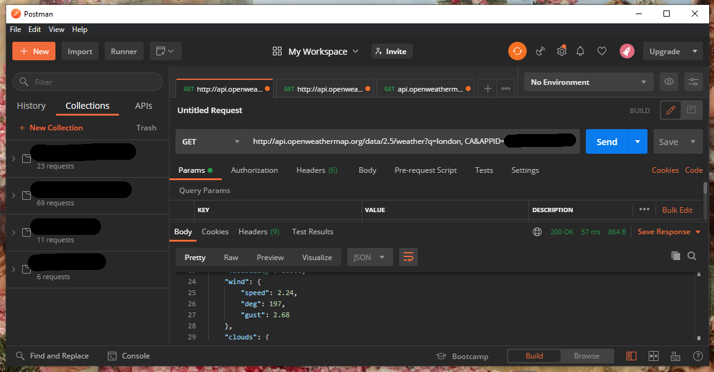

# Weather py
A python terminal app that lets you get the weather forecast for either the next 5 days, today, or the last 5 days.
[Deployed Site](https://edenobrega-weatherpy-5p.herokuapp.com/)

## User Stories
- As a user I want to be able to view the current days weather
- As a user I want to be able to choose where I am viewing
- As a user I want to be able to see the forecast for the next 5 days
- As a user I want to see more detailed data about the current days weather
- As a user I want to be able to see the weather for the last 5 days

## UX
As this is a console line app I am limited to how I can customize the ui, so I have gone with having a bordered header with some ascii art of the projects title, and I generated the ascii art using this [website](https://patorjk.com/software/taag/#p=display&f=Big&t=Weather%20py), and then below that will be a line dedicated to system messages for the user, menu of options for the user to choose from, and then below that will be the loaded data if the user has gone through one of the options atleast once.


## Features
### Existing Features
- Menu
    - A working menu allowing the user to select from the options


- Input Word Completion
    - When entering the country a word completer loaded with all countries will appear
    - When selected the ISO 3166-2 code for the country will be found using the selected country 


## API Wrapper
To help with using the [OpenWeatherMap](https://openweathermap.org/) api I created a wrapper. Due to the limitations on the free tier of the api, the wrapper has been created with only this tier in mind.

note: all parameters of "country" are expected in the format of ISO 3166-2

At the top of the class is a constant of the base url for the api
```python
    BASE_URL = "http://api.openweathermap.org/data/2.5/"
```

When initializing the wrapper it takes two values, an apikey and a unit of measurement, imperial, kelvin or metric
```python
    def __init__(self, api_key, unit):
        self.api_key = api_key
        self.unit = unit
```

### get_json_response(self, url)
A method using functions from the requests package to make the call to a built url and then return it as json. This method has some error catching that is specific to the api, as most requests are returned with a "cod" element but certain endpoints do not have this so this is checked for.
```python
    def get_json_response(self, url):
        response = requests.get(url + f'&APPID={self.api_key}')
        data = response.json()

        if "cod" in data:
            if data["cod"] == "404":
                print("Whoops, something went wrong")
                return response.json()['message']

        return data
```
### get_current_weather(self, country, town)
Gets the current days weather.
A simple endpoint that can be done with only the town and country, so not much needs to be done to prepare the url as the endpoint returns the current weather no date must be passed.
```python
    def get_current_weather(self, country, town):
        request_url = (
            self.BASE_URL +
            'weather' +
            f'?q={town},{country}'
            f'&units={self.unit}'
        )
        return self.get_json_response(request_url)
```
### get_historical_weather((self, country, town, date)
Gets historical data, althought limited to last 5 days due to free tier api.
To get historical data a date is required in the format of UNIX Time, so the date given to the function is parsed and then returned as a timetuple from the datetime library, this tuple is then used to convert to timestamp which is also incased in int() as .mktime returns a float ending in .0 and this removes it.
Unlike the other endpoints used here 'onecall/timemachine' does not take country and town, it instead takes the longitude and latitude, this is not a problem as the longitude and latitude of a town is returned with each call for current weather, so using what is already available in the wrapper, a call is first made to get the curent weather and then the coordinates are taken from there. 
```python
    def get_historical_weather(self, country, town, date):
        timetuple = datetime.strptime(date, "%Y-%m-%d").timetuple()
        timestamp = int(time.mktime(timetuple))

        if (datetime.now().day - timetuple.tm_mday) not in range(0, 6):
            print("Date surpasses 5 day limit")
            return

        current_weather = self.get_current_weather(country, town)

        if isinstance(current_weather, str):
            return current_weather

        request_url = (
            self.BASE_URL +
            'onecall/timemachine'
            f'?lat={str(current_weather["coord"]["lat"])}'
            f'&lon={str(current_weather["coord"]["lon"])}'
            f'&dt={int(timestamp)}'
            f'&units={self.unit}'
        )

        return self.get_json_response(request_url)
```
### get_full_forecast(self, country, town)
This gets a forecast of the next 5 days starting from the current day.
Another simple method+endpoint that does not require any special work.
```python
    def get_full_forecast(self, country, town):
        request_url = (
            self.BASE_URL +
            'forecast'
            f'?q={town},{country}&mode=json'
            f'&units={self.unit}'
        )

        return self.get_json_response(request_url)
```
### get_single_forecast(self, country, town, date)
Gets the forecast for a specific date in the next 5 days.
Gets the full forecast and then returns the date for the specific date, although after finishing coding for the project I found out there is a param for one of the endpoints that takes a single date, which would remove the need to get all the days
```python
    def get_single_forecast(self, country, town, date):
        values = self.get_full_forecast(country, town)

        # given date in unix time
        param_date = datetime.strptime(date, "%d/%m/%Y")

        return_values = []
        date_format = "%Y-%m-%d %H:%M:%S"

        for i in values:
            if (datetime.strptime(i["dt_txt"], date_format).timetuple().tm_mday
                    == param_date.timetuple().tm_mday):
                return_values.append(i)

        return return_values
```

# Data Model
To help with getting the data the api wrapper was put into a class, inside of this class is stored the apikey and settings such as unit of measurement data to be shown in. This helps with not having to constantly pass these values into the methods everytime they are called and reduces the chance of a mistake being made due to human error. Having all the methods to get the data helps with having less code in the run.py and having to only focus on, and see, manipluating the returned json to display the data the user asked for.


# Technologies Used
- Python Libraries
    - [Requests](https://docs.python-requests.org/en/latest/) to help with making API calls
    - [Prompt Toolkit](https://python-prompt-toolkit.readthedocs.io/en/master/) for word completion
    - [pycountry](https://pypi.org/project/pycountry/) to get a list of countries along with ISO codes

- I used the free tier of [Open Weather Map](https://openweathermap.org/) api to get weather data
- For my IDE I used [Gitpod](https://www.gitpod.io/)
- I used [git](https://git-scm.com/) for version control
- [Github](https://github.com/) to help me use git
- [Postman](https://www.postman.com/) helped me test and see first hand the API and its data


# Testing
See [TESTING.md](TESTING.md) for testing.

# Deployment
The app was deployed using heroku, the steps are as follows:
1. For the app to work you will need an API key for the weather api
    1. Go to [OpenWeatherMap](https://openweathermap.org/) 
    1. Create an account (you will have to wait around 5-30min for your account toy activate)
    1. Once logged in, click your name in the top right and select "My API keys"
    1. A default key should be on this page, if not use the form on the right to generate a key
    1. Copy the key to somewhere safe for use in a later step
1. Create an account on heroku and login 
1. In Heroku, select new and "Create new app"
1. Select a unique name and select a region for hosting
1. Navigate to settings, scroll down and create a new config var named "API_KEY" and set value to your key for [OpenWeatherMap](https://openweathermap.org/)
1. While still in settings, scroll to "buildpacks" and install these two packs in the given order:
    1. Python
    2. node.js
1. Go to the deploy tab and connect your github account
1. Once connected, select the respository to be used
1. At the bottom of the deploy page, select "Deploy Branch"

### Local Deployment

In order to make a local copy of this project, you can clone it. In your IDE Terminal, type the following command to clone my repository:

- `git clone https://github.com/edenobrega/weather-app-5p.git`

Alternatively, if using Gitpod, you can click below to create your own workspace using this repository.

[](https://gitpod.io/#https://github.com/edenobrega/weather-app-5p)

In order to install the required python packages for this application locally, use the following command in your terminal:
- pip3 install -r requirements.txt
Once you've got the packages installed, in order to freeze these packages for deployment on Heroku, type the following:
- pip3 freeze --local > requirements.txt

# Credits
Used code from [here](https://stackoverflow.com/questions/287871/how-to-print-colored-text-to-the-terminal) for coloring the terminal
[Postman](https://www.postman.com/) to test the api before implementing in code
[OpenWeatherMap](https://openweathermap.org/) api to get weather data live