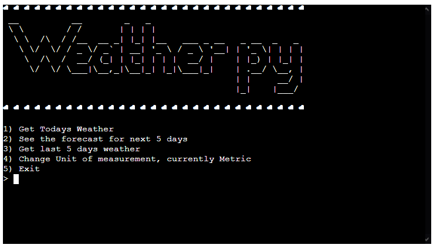

# Weather py
A python terminal app that lets you get the weather forecast for either the next 5 days, today, or the last 5 days.

## User Stories
- As a user i want to be able to view the current days weather
- As a user i want to be able to choose where i am viewing
- As a user i want to be able to see the forecast for the next 5 days
- As a user i want to see more detailed data about the current days weather
- As a user i want to be able to see the weather for the last 5 days

## UX
As this is a console line app I am limited to how I can customize the ui, so I have gone with having a bordered header with some ascii art of the projects title, and I generated the ascii art using this [website](https://patorjk.com/software/taag/#p=display&f=Big&t=Weather%20py), and then below that will be a line dedicated to system messages for the user, menu of options for the user to choose from, and then below that will be the loaded data if the user has gone through one of the options atleast once.

## Features
### Existing Features
- Menu
    - A working menu allowing the user to select from the options

- Input Word Completion
    - When entering the country a word completer loaded with all countries will appear
    - When selected the ISO 3166-2 code for the country will be found using the selected country 

# Technologies Used
- Python Libraries
    - [Requests](https://docs.python-requests.org/en/latest/) to help with making API calls
    - [Prompt Toolkit](https://python-prompt-toolkit.readthedocs.io/en/master/) for word completion
    - [pycountry](https://pypi.org/project/pycountry/) to get a list of countries along with ISO codes

- I used the free tier of [Open Weather Map](https://openweathermap.org/) api to get weather data
- For my IDE i used [Gitpod](https://www.gitpod.io/)
- I used [git](https://git-scm.com/) for version control
- [Github](https://github.com/) to help me use git

# Deployment
The app was deployed using heroku, the steps are as follows:
1. In Heroku, select new and "Create new app"
2. Name and select a region for hosting
3. Navigate to settings and create a new config var named "API_KEY" and set value to your key for [Open Weather Map](https://openweathermap.org/)
