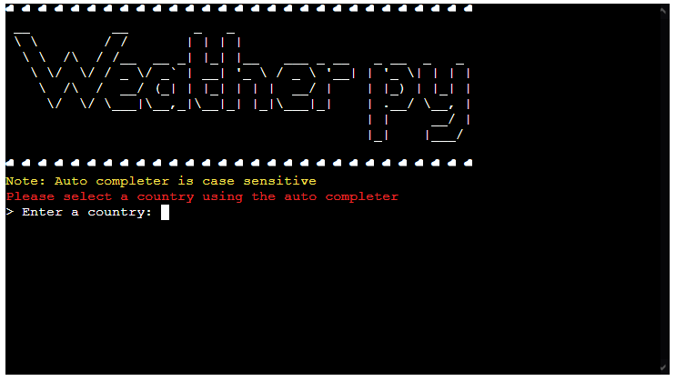
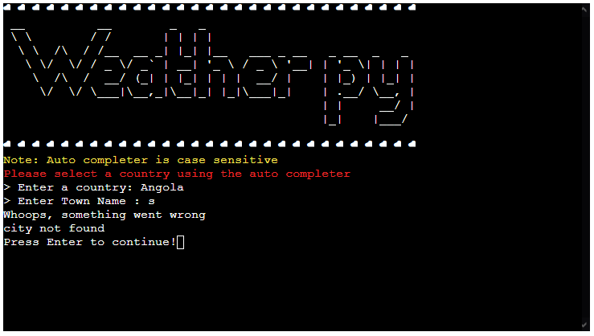

# Weather py
A python terminal app that lets you get the weather forecast for either the next 5 days, today, or the last 5 days.
[Deployed Site](https://edenobrega-weatherpy-5p.herokuapp.com/)

## User Stories
- As a user I want to be able to view the current days weather
- As a user I want to be able to choose where I am viewing
- As a user I want to be able to see the forecast for the next 5 days
- As a user I want to see more detailed data about the current days weather
- As a user I want to be able to see the weather for the last 5 days

## UX
As this is a console line app I am limited to how I can customize the ui, so I have gone with having a bordered header with some ascii art of the projects title, and I generated the ascii art using this [website](https://patorjk.com/software/taag/#p=display&f=Big&t=Weather%20py), and then below that will be a line dedicated to system messages for the user, menu of options for the user to choose from, and then below that will be the loaded data if the user has gone through one of the options atleast once.

## Features
### Existing Features
- Menu
    - A working menu allowing the user to select from the options

- Input Word Completion
    - When entering the country a word completer loaded with all countries will appear
    - When selected the ISO 3166-2 code for the country will be found using the selected country 

# Technologies Used
- Python Libraries
    - [Requests](https://docs.python-requests.org/en/latest/) to help with making API calls
    - [Prompt Toolkit](https://python-prompt-toolkit.readthedocs.io/en/master/) for word completion
    - [pycountry](https://pypi.org/project/pycountry/) to get a list of countries along with ISO codes

- I used the free tier of [Open Weather Map](https://openweathermap.org/) api to get weather data
- For my IDE I used [Gitpod](https://www.gitpod.io/)
- I used [git](https://git-scm.com/) for version control
- [Github](https://github.com/) to help me use git
- [Postman](https://www.postman.com/) helped me test and see first hand the API and its data

# Testing
I used [pep8online](http://pep8online.com/checkresult) to show the checks online

Validation for run.py

Validation for weather_wrapper.py

Entering a value that is not 1 to 3 should not be expected

Entering a value that is not from the completion list

Entering a value brings up the completor with relevant countries

Entering a town that does not exist will cause an error

Selecting option 1 while return relevant information

Selecting option 2 while return relevant information

Selecting option 3 while return relevant information

# Bugs
To my knowledge there are currently no bugs.

# Deployment
The app was deployed using heroku, the steps are as follows:
1. For the app to work you will need an API key for the weather api
    1. Go to [OpenWeatherMap](https://openweathermap.org/) 
    1. Create an account (you will have to wait around 5-30min for your account toy activate)
    1. Once logged in, click your name in the top right and select "My API keys"
    1. A default key should be on this page, if not use the form on the right to generate a key
    1. Copy the key to somewhere safe for use in a later step
1. Create an account on heroku and login 
1. In Heroku, select new and "Create new app"
1. Select a unique name and select a region for hosting
1. Navigate to settings, scroll down and create a new config var named "API_KEY" and set value to your key for [OpenWeatherMap](https://openweathermap.org/)
1. While still in settings, scroll to "buildpacks" and install these two packs in the given order:
    1. Python
    2. node.js
1. Go to the deploy tab and connect your github account
1. Select the respository to be used
1. At the bottom of the deploy page, select "Deploy Branch"

### Local Deployment

In order to make a local copy of this project, you can clone it. In your IDE Terminal, type the following command to clone my repository:

- `git clone https://github.com/edenobrega/weather-app-5p.git`

Alternatively, if using Gitpod, you can click below to create your own workspace using this repository.

In order to install the required python packages for this application locally, use the following command in your terminal:
- pip3 install -r requirements.txt
Once you've got the packages installed, in order to freeze these packages for deployment on Heroku, type the following:
- pip3 freeze --local > requirements.txt

# Credits
Used code from [here](https://stackoverflow.com/questions/287871/how-to-print-colored-text-to-the-terminal) for coloring the terminal
[Postman](https://www.postman.com/) to test the api before implementing in code
[OpenWeatherMap](https://openweathermap.org/) api to get weather data live