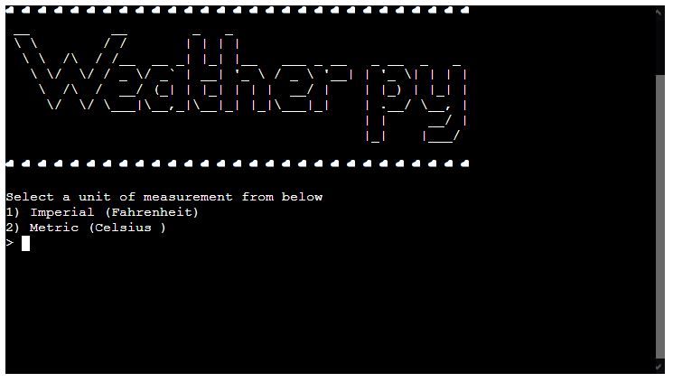
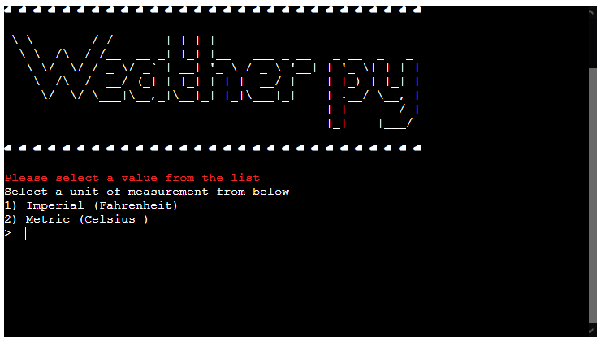
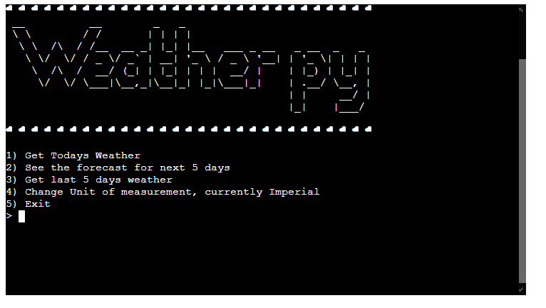

# Testing
I used [pep8online](http://pep8online.com/checkresult) to show the checks online

Validation for run.py

Validation for weather_wrapper.py

Entering a value that is not 1 to 3 should not be expected

Entering a value that is not from the completion list

Entering a value brings up the completor with relevant countries

Entering a town that does not exist will cause an error

Selecting option 1 while return relevant information

Selecting option 2 while return relevant information

Selecting option 3 while return relevant information

Changing the units of measurement

Entering an incorrect value for changing units of measurement

Unit of measurement in menu changing afterwards

# Bugs
To my knowledge there are currently no bugs.