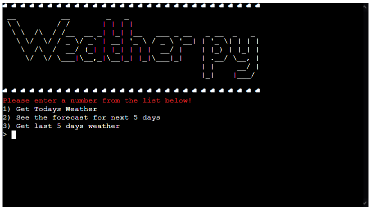
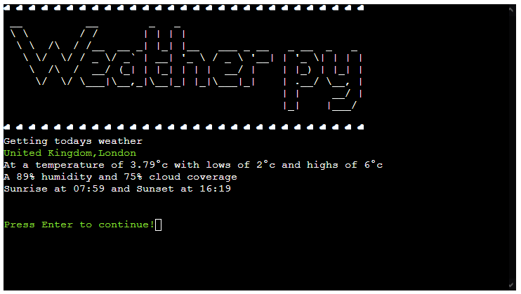
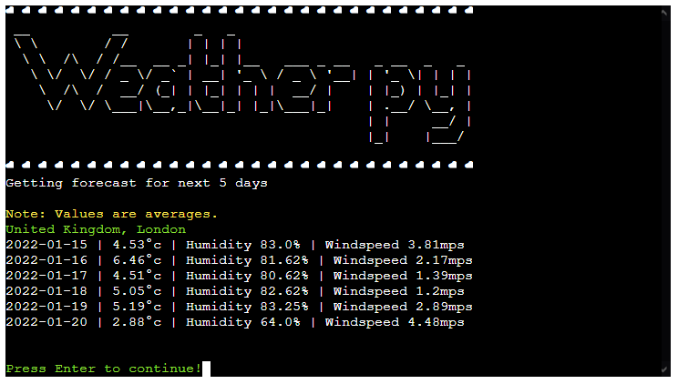
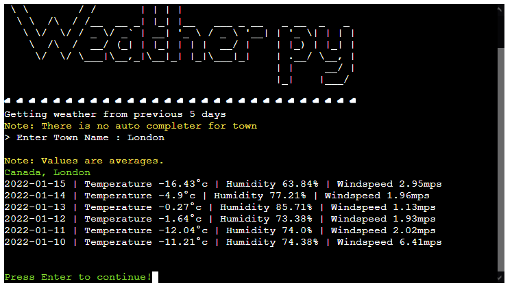
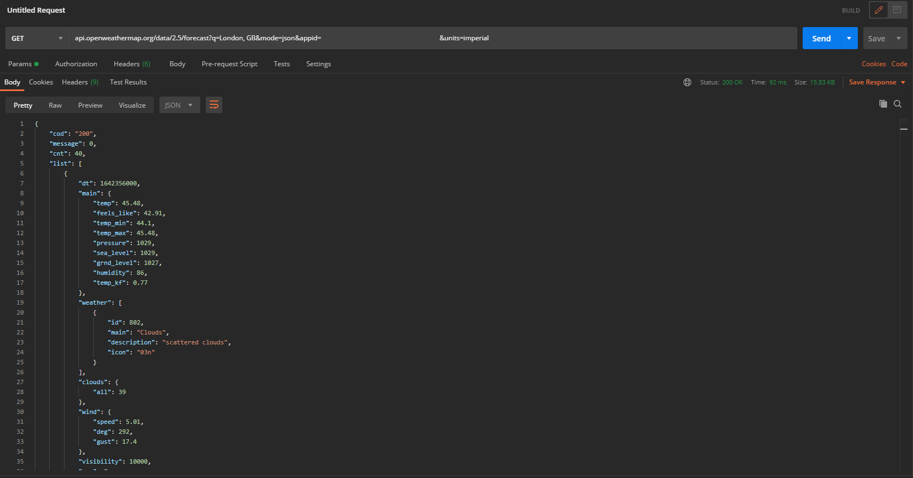

# Testing
I used [pep8online](http://pep8online.com/checkresult) to show the checks online

Validation for run.py

Validation for weather_wrapper.py

Entering a value that is not 1 to 3 should not be expected

Entering a value that is not from the completion list

Entering a value brings up the completor with relevant countries

Entering a town that does not exist will cause an error

Selecting option 1 while return relevant information

Selecting option 2 while return relevant information

Selecting option 3 while return relevant information

Changing the units of measurement

Entering an incorrect value for changing units of measurement

Unit of measurement in menu changing afterwards

Before creating the wrapper (see "API Wrapper" in README.md) I used postman so that I could see first-hand what data was returned, as shown below

Using Postman to make a call to London, Canada

# Bugs
When entering a country into the country input it will treat words after a space a new word rather than the whole input as one phrase.
Other than that there are no known bugs